<!--

author: Moritz Riemann
email:  riemann@philsem.uni-kiel.de
version: 0.1
language: en
narrator: UK English Female

\-->

# A bunch of Italian Fascist Intellectuals (1919–1945): “Who is Who?” — Short Bios & Idea Mapping

---

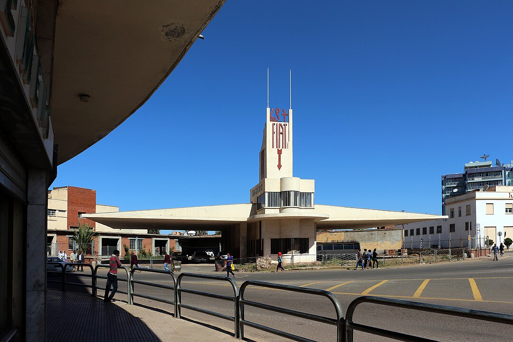

(Fiat Tagliero Building by Giuseppe Pettazzi, Asmara/Eritrea 1938)

## 1. Benito Mussolini (1883-1945) 

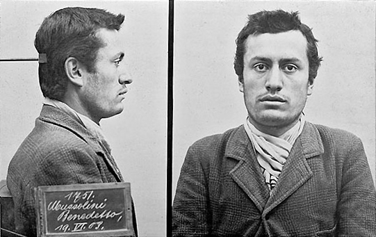

**Role:** Founder and leader of the Italian Fascist movement; journalist; head of government (1922–1943).  

**Bio:** Originally a socialist journalist, he broke with socialism during WWI, founded the *Fasci di Combattimento* (1919) and later the Fascist Party. *March on Rome in October 1922*, appointed prime minister of Italy by King Victor Emmanuel III. His dictatorship promoted nationalism, corporatism, imperial expansion, and state-controlled social life. Removed from political power in 1943, killed as a fugitive from justice in 1945.  

**Core Ideas / Fields:**

* Totalitarian leadership & mass mobilization
* Ethical state (*stato etico*)
* Corporatism as alternative to liberalism & socialism
* Militarism, nationalism, imperial expansion

---

## 2. Giovanni Gentile (1875-1944)

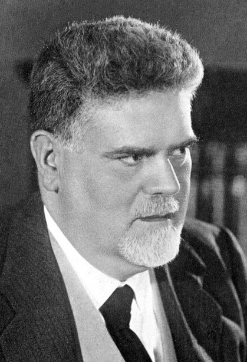

**Role:** Philosopher; main theoretician of fascism; Minister of Education (1923).  

**Bio:** Leading idealist philosopher; co-authored the *Doctrine of Fascism* with Mussolini (1932) and designed the Gentile reform of education. He saw fascism as the expression of a unified ethical state. Killed by the Resistenza/GAP in 1944.  

**Core Ideas / Fields:**

* Actual idealism (subjective idealism)
* Ethical state (*stato etico*)
* Educational reform for citizen molding
* Anti-liberal, anti-individualist thought

---

## 3. Alfredo Rocco (1875-1935)

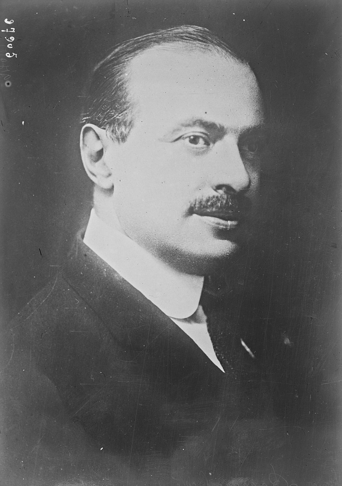

**Role:** Jurist; Minister of Justice; architect of fascist legal structure.

**Bio:** Drafted major laws consolidating the dictatorship and dismantling liberal institutions. A central architect of fascist corporatism. Oppponent to the totalitarian approach of the squadristi.

**Core Ideas / Fields:**

* Corporative state theory
* Anti-parliamentarianism
* Authoritarian legal theory
* Primacy of state over individual

---

## 4. Roberto Farinacci (1892-1945)

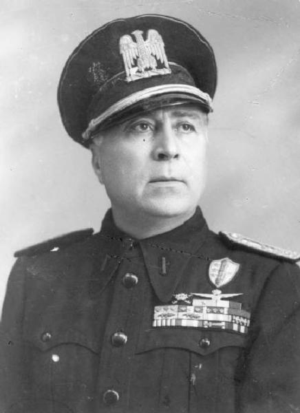

**Role:** Radical fascist leader; journalist; party organizer. "Right hand" od Mussolini.

**Bio:** Symbol of militant fascist extremism, involved in early squadrist violence. Later an advocate of strong alignment with Nazi Germany. Executed in 1945.

**Core Ideas / Fields:**

* Hyper-nationalism
* Anti-democratic activism
* Racialist positions (late 1930s)
* Paramilitarism & party discipline

---

## 5. Italo Balbo (1896)

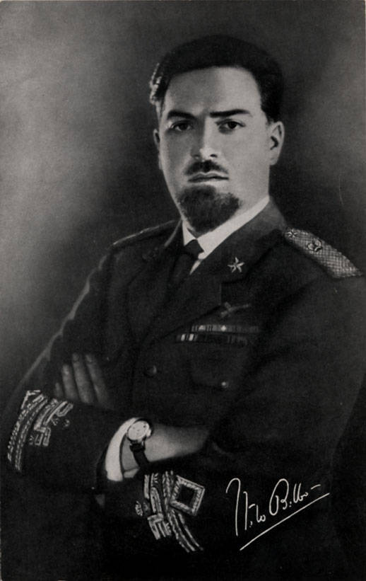

**Role:** Fascist leader; aviator; Minister of Aviation; Governor of Libya.

**Bio:** A prominent squadrist and symbol of regime modernity through celebrated transatlantic flights. Represented a more pragmatic, modernist vision of fascism. Killed by Italian anti-aircraft guns on a flight to Tobruk in 1940.

**Core Ideas / Fields:**

* Technocratic modernism
* Imperialism & colonization
* Aviation as propaganda
* National prestige, mass spectacle

---

## 6. Curzio Malaparte (1898-1957)

**Role:** Writer, journalist, commentator.

**Bio:** Early fascist propagandist who later adopted a more critical, ambiguous stance. Took part in Mussolinis *March on Rome*. Portrayal of Fascist and Bolshevik Revolutions in *Coup d'État: The Technique of Revolution* (1941). His book *The Volga Rises in Europe* is a collection of newspaper articles from the Eastern Front and includes an interview with Hans Frank. His novels (*Kaputt*, *The Skin*) portray totalitarian Europe with modernist irony. 

**Core Ideas / Fields:**

* Political aesthetics of violence
* Literary modernism
* Ambiguous relation to fascism
* Commentary on power & war

---

## 7. Julius Evola (1898-1974)

**Role:** Esoteric philosopher; far-right intellectual (not formally a party member).

**Bio:** Advocate of a spiritual, aristocratic authoritarianism. Influential on fascist and later far-right racial and traditionalist currents.

**Core Ideas / Fields:**

* Traditionalism & anti-modernity
* Magical Idealism and spiritual racism
* Anti-democratic elitism
* Esotericism & metaphysics
* Umberto Eco mocked Evola; his 1995 essay "Ur-Fascism" referred to Evola as the "most influential theoretical source of the theories of the new Italian right", and as "one of the most respected fascist gurus".

---

## 8. Sergio Panunzio (1886-1944)

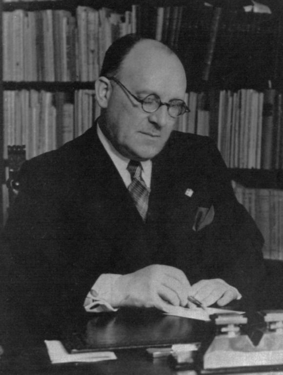

**Role:** Jurist and sociologist; theorist of syndicalism within fascism.

**Bio:** A key figure in transforming revolutionary syndicalism into fascist corporatist theory.

**Core Ideas / Fields:**

* National syndicalism
* Corporatism
* State intervention in labor
* Institutional social discipline

---

## 9. Filippo Tommaso Marinetti (1976-1944)

**Role:** Poet; founder of Futurism; cultural propagandist of fascist modernism.

**Bio:** Avant-garde pioneer (*Manifesto of Futurism* 1909); early supporter of Mussolini (co-author *Fascist Manifesto* 1919). Saw fascism as realizing the Futurist vision of violent rupture and technological dynamism.

**Core Ideas / Fields:**

* Futurism (speed, technology, modernity)
* Aesthetics of violence & heroism
* Cultural revolution aligned with nationalism
* Modernist propaganda

---

# Central Idea Map (Overview)

| Thinker   | Main Fields               | Core Concepts                                |
| --------- | ------------------------- | -------------------------------------------- |
| Mussolini | Politics, propaganda      | Totalitarian state; corporatism; nationalism |
| Gentile   | Philosophy, education     | Ethical state; idealism; anti-individualism  |
| Rocco     | Law, state theory         | Authoritarian legal order; corporatism       |
| Farinacci | Party ideology            | Radical nationalism; paramilitarism          |
| Balbo     | Aviation, colonial policy | Modernism; imperialism; spectacle            |
| Malaparte | Literature, journalism    | Political aesthetics; modernist critique     |
| Evola     | Esotericism, philosophy   | Traditionalism; hierarchy; anti-modernity    |
| Panunzio  | Sociology, syndicalism    | National syndicalism; social corporatism     |
| Marinetti | Art, culture              | Futurism; aesthetic militarism               |

---

# Anti-Fascist Intellectuals Around Benedetto Croce (1919–1945): “Who is Who?” — Short Bios, Idea Mapping and Link to the Manifesto

---

## 1. **Benedetto Croce (1866–1952)**

**Role:** Philosopher; liberal senator; intellectual leader of anti-fascism.

**Main author and signatory** of the *Manifesto of Anti-Fascist Intellectuals* (1925).

**Bio:** Central figure of Italian liberal culture; opposed fascism early and publicly.

**Core Ideas / Fields:**

* Philosophical liberalism
* Historicism
* Moral autonomy
* Defense of civil liberties

---

## 2. **Giovanni Amendola (1882–1926)**

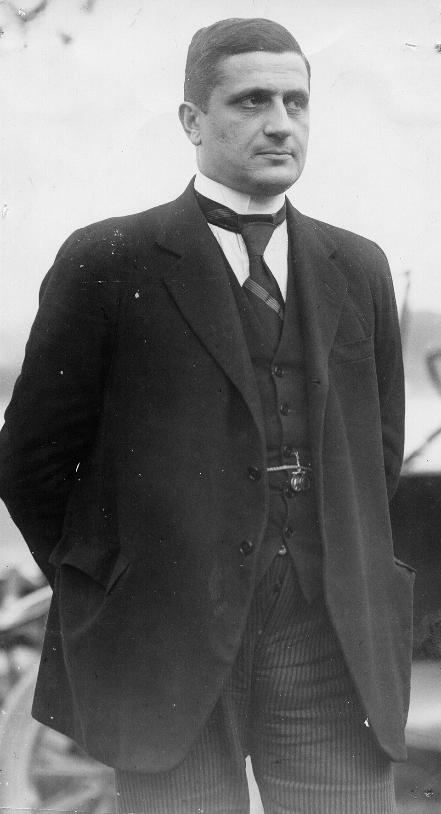

**Role:** Journalist, liberal politician.

**Signed** the 1925 Manifesto.

**Bio:** Early critic of Mussolini, coined “totalitarian state,” led oppositional parliamentary actions.

**Core Ideas / Fields:**

* Liberal constitutionalism
* Parliamentary democracy
* Anti-totalitarian critique
* Press freedom

---

## 3. **Piero Gobetti (1901–1926)**

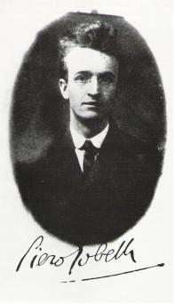

**Role:** Journalist, publisher, political theorist.

**Did not sign the Manifesto** (Sympathetic to Croce but maintained independent, radical liberal positions; severely repressed in 1925–26.)

**Bio:** Advocated civic renewal; died in exile after fascist assaults.

**Core Ideas / Fields:**

* Radical liberalism
* Civic virtue & responsibility
* Cultural modernization
* Anti-authoritarianism

---

## 4. **Luigi Sturzo (1871–1959)**

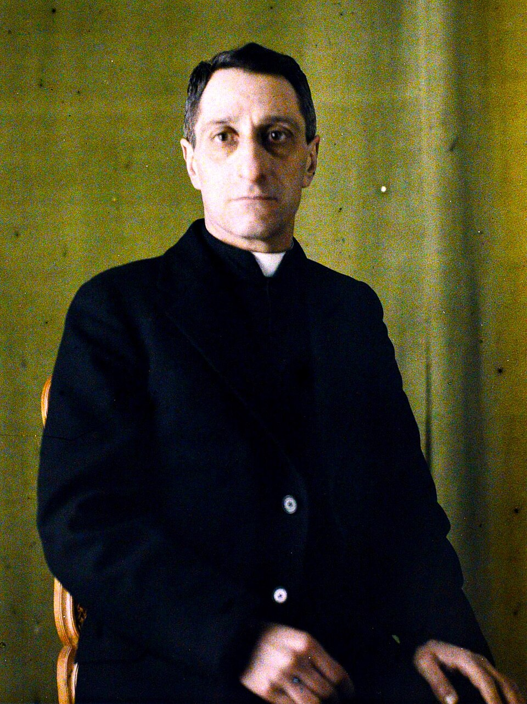

**Role:** Priest; founder of the Italian Popular Party.

**Did not sign the Manifesto** (Already forced into exile in 1924; spoke out independently.)

**Bio:** Ethical, Christian-democratic opponent of fascism.

**Core Ideas / Fields:**

* Christian democracy
* Subsidiarity
* Ethical politics
* Civil society

---

## 5. **Gaetano Salvemini (1873–1957)**

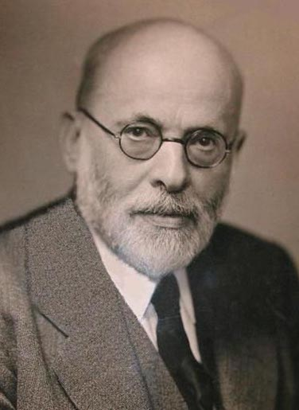

**Role:** Historian, politician, exiled intellectual; co-founder of *Giustizia e Libertà* (with Carlo and Nello Rosselli)

**Did not sign the Manifesto** (Arrested and then escaped abroad; leadership in exile.)

**Bio:** Among the earliest critics; organized anti-fascist activism in exile.

**Core Ideas / Fields:**

* Democratic historiography
* Anti-nationalism
* Anti-imperial critique
* Rationalist political debate

---

## 6. **Carlo Rosselli (1899–1937)**

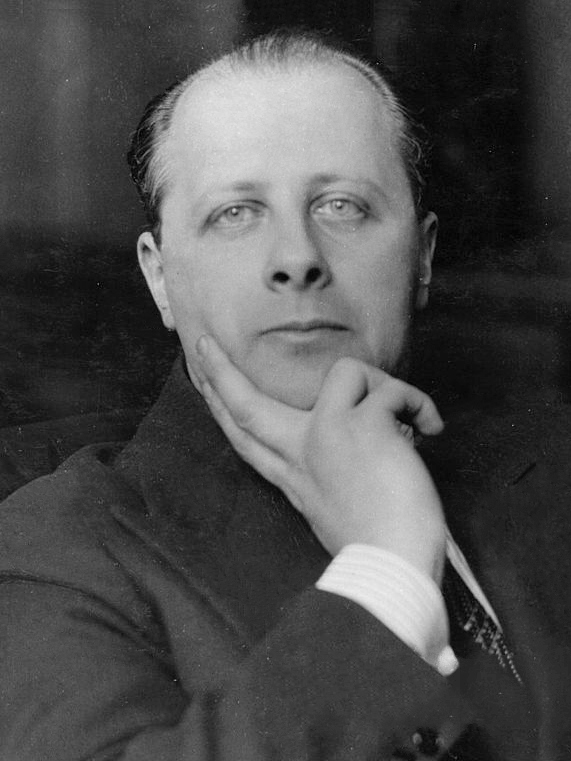

**Role:** Political thinker; founder of *Giustizia e Libertà*.

**Did not sign the Manifesto** (Emerging as a key figure slightly later; arrested in 1926.)

**Bio:** Pioneered “liberal socialism”; assassinated by fascist agents in France alongside his Brother Nello.

**Core Ideas / Fields:**

* Liberal socialism
* Ethical resistance
* Civil liberties
* Social justice

---

## 7. **Emilio Lussu (1890–1975)**

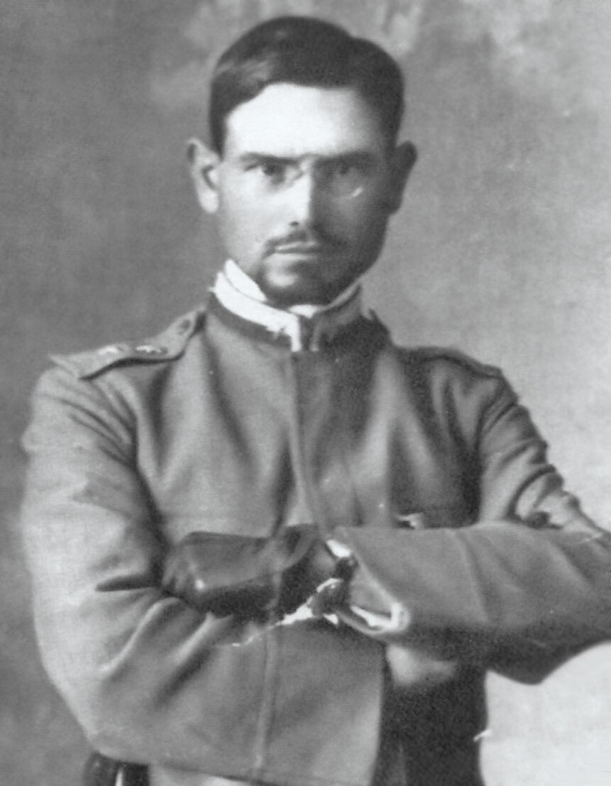

**Role:** Writer, politician, resistance organizer.

**Did not sign the Manifesto**

**Bio:** Anti-fascist after WWI; co-founded *Giustizia e Libertà*; memoirist of resistance.

**Core Ideas / Fields:**

* Republican democracy
* Anti-militarism
* Political pluralism
* Testimonial literature

---

## 8. **Antonio Gramsci (1891–1937)**

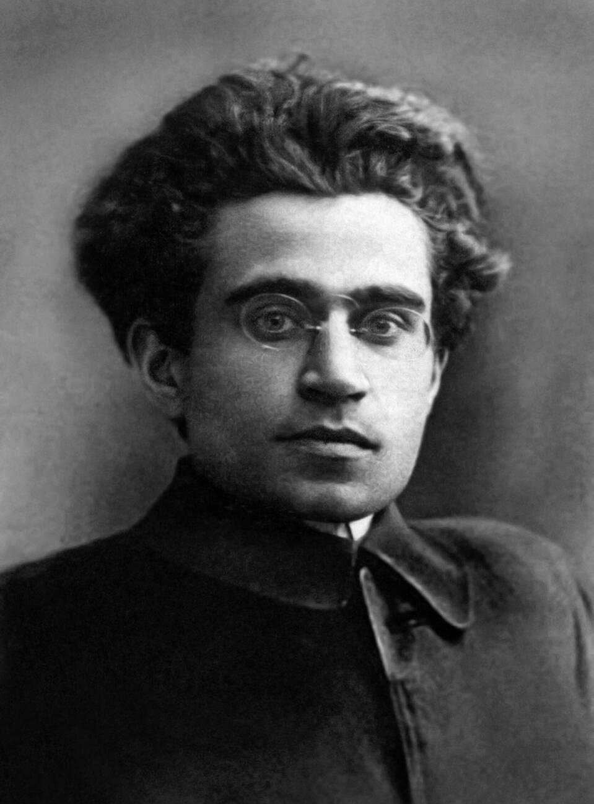

**Role:** Marxist philosopher; founder of the Italian Communist Party.

**Did not sign the Manifesto** (Communists were not part of Croce’s liberal initiative; imprisoned in 1926.)

**Bio:** Produced the *Prison Notebooks*, foundational for cultural and political theory. Died shortly after being moved form prison to hospital 

**Core Ideas / Fields:**

* Cultural hegemony
* Organic intellectuals
* Civil society & ideology critique
* Anti-fascist Marxism

---

## 9. **Norberto Bobbio (1909–2004)**

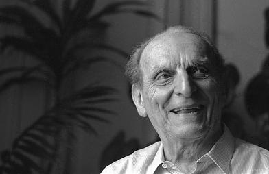

**Role:** Philosopher, jurist.

**Did not sign the Manifesto** (Too young in 1925; influenced later by Croce and Rosselli.)

**Bio:** Later a key theorist of democracy, the rule of law, and liberal socialism.

**Core Ideas / Fields:**

* Democratic theory
* Rule of law
* Rights & constitutionalism
* Liberal socialism

---

# Central Idea & Manifesto Map (Overview)

| Thinker                           | Main Fields          | Core Concepts                  | Manifesto (1925)       |
| --------------------------------- | -------------------- | ------------------------------ | ---------------------- |
| **Benedetto Croce (1866–1952)**   | Philosophy, history  | Liberal idealism; historicism  | **Author & Signatory** |
| **Giovanni Amendola (1882–1926)** | Politics, journalism | Anti-totalitarianism           | **Signatory**          |
| **Piero Gobetti (1901–1926)**     | Publishing, theory   | Radical liberalism             | —                      |
| **Luigi Sturzo (1871–1959)**      | Christian democracy  | Ethical politics; subsidiarity | —                      |
| **Gaetano Salvemini (1873–1957)** | History, politics    | Democratic rationalism         | —                      |
| **Carlo Rosselli (1899–1937)**    | Political theory     | Liberal socialism              | —                      |
| **Emilio Lussu (1890–1975)**      | Memoirs, politics    | Republicanism                  | —                      |
| **Antonio Gramsci (1891–1937)**   | Marxist theory       | Cultural hegemony              | —                      |
| **Norberto Bobbio (1909–2004)**   | Philosophy, law      | Democracy; legality            | —                      |

---

